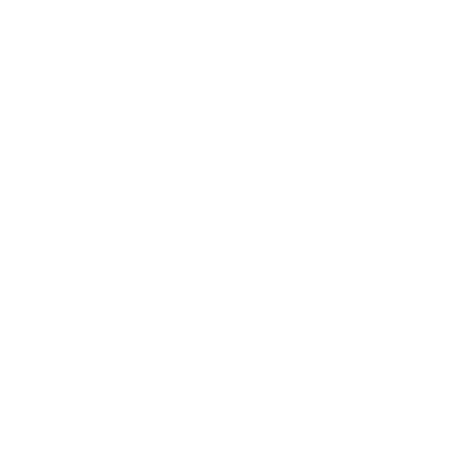

# 🌃 Matheus Augusto Baiocco Merlos

`Matheus 'Azure' Augusto`

## Sobre mim!

Sou um estudante de desenvolvimento de software extremamente dedicado e apaixonado por tecnologia, com o objetivo de me tornar um profissional na área de DevOps. Minha jornada na programação é impulsionada pela curiosidade e pela vontade constante de aprender.

### Meu Approach

Meus projetos são criados com base nas ideias que surgem enquanto estudo e programo. Eu os utilizo como oportunidades para expandir meu conhecimento, sempre explorando novos frameworks e linguagens. Essa abordagem me permite construir aplicações funcionais, e também aprofundar minha compreensão das tecnologias que utilizo.

<h2 style="align: center";>🌙 Linguagens:</h2>

    
    
    
    
    
    

 

<h2 style="align: center";>🛠️ Ferramentas</h2>

    
    
    
    
    
    
    
    
    

#
 

